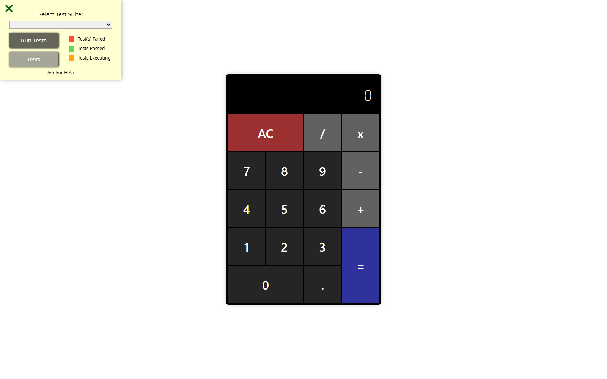

# JavaScript Calculator

A small React learning project with an on-screen arithmetic keypad. It explores input state, operator handling, expression evaluation, and a CSS-grid interface.



## Controls

Click the buttons to enter a calculation:

| Button | Action |
| --- | --- |
| `0–9` | Enter digits. |
| `.` | Enter a decimal point in the current operand. |
| `+`, `-`, `x`, `/` | Choose an arithmetic operation. |
| `=` | Evaluate the expression. |
| `AC` | Clear the expression and result. |

This implementation uses button clicks rather than keyboard shortcuts. Results are rounded to up to four decimal places, with trailing zeros removed. It does not include calculation history, backspace, percentages, or scientific functions.

## Run locally

Install Node.js and npm, then:

```bash
git clone https://github.com/gradywasil/js-calculator.git
cd js-calculator
npm ci
npm run dev
```

Open the local URL printed by Vite.

| Command | Purpose |
| --- | --- |
| `npm run dev` | Start the development server. |
| `npm run build` | Build the site into `dist/`. |
| `npm run preview` | Preview a completed build locally. |
| `npm run lint` | Run the configured ESLint checks. |

The locked stack is React 18.2, Vite 4.3.9, JavaScript/JSX, and plain CSS. The project has no explicit Node-version pin.

## Implementation

`src/App.jsx` holds the expression/result state, input handlers, and keypad. Expressions are evaluated through JavaScript's `Function` constructor, then formatted with `toFixed(4)` and `parseFloat`. This is an educational implementation using ordinary JavaScript number behavior, not arbitrary-precision arithmetic.

`src/App.css` and `src/index.css` define the fixed-size layout. `index.html` loads the app and freeCodeCamp's external test harness; that harness's presence is not a claim that its tests pass or that a course was completed.

Arithmetic runs locally without an application backend or sign-in. The committed page still makes the external test-harness request.

## Status and limits

The interface uses a fixed-width layout. The source renders both the current input and result, and input handlers do not consistently clear the previous result. It also has no explicit finite-value or divide-by-zero handling. Keep these limitations in mind when exploring the code.

### Verification

A bounded local pass used Node 24.9.0, npm 11.6.0, and isolated browser state. The production build and lint passed. Button-based checks confirmed `2+3*4=14`, `1.2+2.3=3.5`, ignoring a second decimal point (`1.2.3` became `1.23`), `1/3=0.3333`, and AC clearing the state.

The stale-result behavior was reproduced: pressing `4` after `1/3=` changed the input to `0.33334` while the previous result remained `0.3333`. A 390-pixel viewport showed existing clipping. No source fix was included.

The screenshot is an authentic, unscaled **1600 × 1000** capture of source commit `71725127fd516de4a04fd75bfa178d1f13473dcb`. Its visible freeCodeCamp panel is not a recorded test result. This was a focused interaction check, not exhaustive arithmetic validation.

No repository license is included; public source availability does not itself grant a blanket reuse license.
